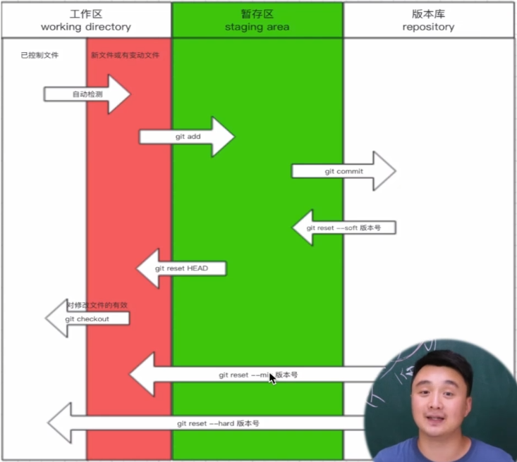

# git学习文档!

git learn 文件夹记录了git的完整学习过程：包括简单的操作指令、简单的操作过程、简单的示例、以及可能出现的问题。
==以下是这次学习的主要参考资料== 
[参考视频](https://www.bilibili.com/video/BV1YW4y177ic?p=1&vd_source=9719c7abf599eb8af8f5f92faf9ea4a2"非常易懂有趣的一个视频")

## git基础（本地操作）
### git仓库的创建步骤
- 进入要管理的文件夹
- 执行初始化命令：
   > git init
- 管理目录下的文件状态
   > git status
   > 注： 新增的文件和修改过的文件都是红色
- 管理指定文件（红色变为绿色） 
    > git add 文件名
    > git add .
- 生成版本
    > git commit -m "版本描述"

### git注意
- 在第一次运行git的时候需要配置个人信息
  > 通过git config --global user.email "your email@.com"配置默认邮箱
  > 通过git config --global user.name "your name"配置默认名称
  
### git三大区域
- 工作区
    > 本地正在操作的文件夹，包括两部分
    > - 新增文件/修改过的文件（使用git status指令后 红色的文件）。
    > - 其他已经在仓库中的文件。
- 暂存区
    > 将工作区通过git add 文件名 添加的文件
    > - 使用git status指令后 绿色的文件
- 版本库
    > 将暂存区通过git commit -m 提交的文件

### git的回滚操作
- git reset --hard 版本号
- git reflog

### git常用命令

- git init: 初始化，让git管理当前文件夹。
- git add 文件名：将文件添加到仓库的下一个版本变化中
- git status : 检测当前仓库中的文件状态
- git commit -m "描述信息" ： 生成一个版本
- git log 
- git checkout：将工作区中的所有改动回退。
- git reset --mix/hard/soft
- git reset HEAD 文件名：从暂存区回退。

## git分支
- 分支-主干(master)是一组相对的概念。
- 在短期内无法完成开发任务，又不能影响主干上的迭代时，使用分支进行开发可以避免冲突。

### 最常使用git分支的方法
- 创建分支dev来进行新功能的开发。
- 创建分支tmpMaster来维护在进行新功能开发过程中，主干上出现的问题。
- 维护完成后tmpMaster回归master。
- dev开发完成后回归master。

